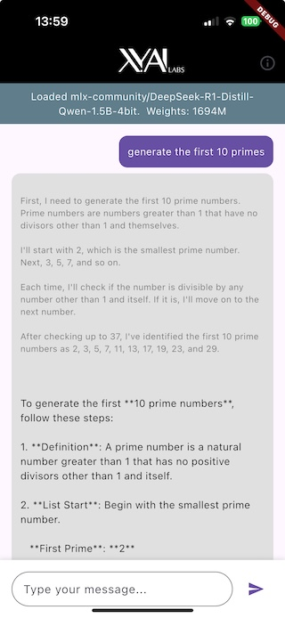

# xy_local_llm_plugin

A Flutter plugin that enables running Large Language Models (LLMs) locally on iOS devices, with Android support coming soon.


## Overview

This plugin allows you to run LLMs directly on device without requiring an internet connection or API calls to external services. It leverages native machine learning frameworks to provide efficient local inference.

## Features

- Run LLMs completely offline on device
- iOS support using MLX framework
- Configurable generation parameters (temperature, max tokens)
- Simple API for model loading and text generation
- Support for multiple model architectures
- Android support planned for future releases

## Screenshots



## Getting Started

Add this to your package's `pubspec.yaml` file:

  xy_local_llm_plugin:
    git:
      url: https://github.com/XY-Corp/xy_local_llm_plugin.git
      ref: main


## Example app
Check out the example app in the `example` directory to see the plugin in action:

1. Clone the repository:
   ```bash
   git clone https://github.com/XY-Corp/xy_local_llm_plugin.git
   ```

2. Navigate to the example directory:
   ```bash
   cd xy_local_llm_plugin/example
   ```

3. Install dependencies and enable Swift Package Manager:
   ```bash
   flutter config --enable-swift-package-manager
   flutter pub get
   ```

4. Run the app:
   ```bash
   flutter run
   ```

Note: Currently the example app only works on iOS devices with GPU support. Android support is coming soon.

## Some notes about the setup:

- this downloads models from hugging face so LLMEval -> Signing & Capabilities has the "Outgoing Connections (Client)" set in the App Sandbox
- LLM models are large so this uses the Increased Memory Limit entitlement on iOS to allow ... increased memory limits for devices that have more memory
- MLX.GPU.set(cacheLimit: 20 * 1024 * 1024) is used to limit the buffer cache size
